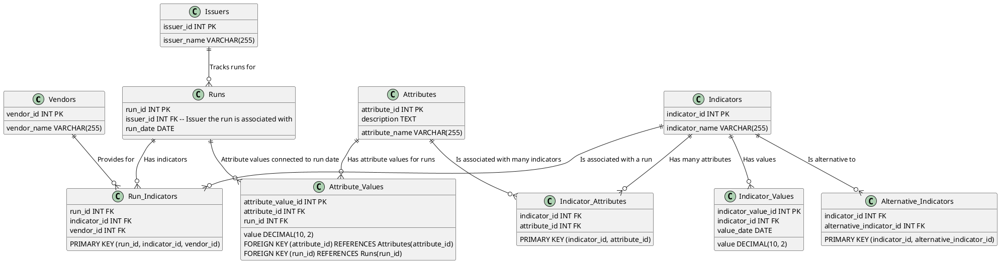

# PostgreSQL Database Schema for Indicators, Attributes, and Runs

This repository provides the SQL script to create a PostgreSQL database schema that tracks **indicators**, **attributes**, and their **values** across multiple **runs**, with data provided by various **vendors**. It supports **many-to-many** relationships between indicators and attributes, meaning an indicator can have multiple attributes, and an attribute can belong to multiple indicators.

## Database Schema Overview

The schema includes the following tables:

1. **Vendors**: Represents the vendors providing data for specific indicators during runs.
2. **Issuers**: Represents the organizations or entities responsible for tracking runs.
3. **Runs**: Represents a single occurrence (a snapshot in time) where indicators are tracked.
4. **Indicators**: Represents metrics or measurements that are tracked (e.g., temperature, humidity).
5. **Attributes**: Represents specific attributes related to an indicator (e.g., max temperature, min temperature).
6. **Indicator_Attributes**: A join table representing the many-to-many relationship between indicators and attributes.
7. **Run_Indicators**: A table that connects indicators, runs, and vendors.
8. **Indicator_Values**: Represents the actual value of an indicator recorded on a specific date.
9. **Attribute_Values**: Represents the value of an attribute in a specific run.
10. **Alternative_Indicators**: Represents alternative indicators for a given indicator.

## PostgreSQL SQL Schema Initialization

Here is the SQL script to initialize the database schema.

```sql
-- Vendors Table
CREATE TABLE Vendors (
    vendor_id SERIAL PRIMARY KEY,
    vendor_name VARCHAR(255) NOT NULL
);

-- Issuers Table
CREATE TABLE Issuers (
    issuer_id SERIAL PRIMARY KEY,
    issuer_name VARCHAR(255) NOT NULL
);

-- Runs Table
CREATE TABLE Runs (
    run_id SERIAL PRIMARY KEY,
    issuer_id INT NOT NULL REFERENCES Issuers(issuer_id) ON DELETE CASCADE,
    run_date DATE NOT NULL,
    UNIQUE (issuer_id, run_date)
);

-- Indicators Table
CREATE TABLE Indicators (
    indicator_id SERIAL PRIMARY KEY,
    indicator_name VARCHAR(255) NOT NULL,
    UNIQUE (indicator_name)
);

-- Run_Indicators Table
CREATE TABLE Run_Indicators (
    run_id INT NOT NULL REFERENCES Runs(run_id) ON DELETE CASCADE,
    indicator_id INT NOT NULL REFERENCES Indicators(indicator_id) ON DELETE CASCADE,
    vendor_id INT NOT NULL REFERENCES Vendors(vendor_id) ON DELETE CASCADE,
    PRIMARY KEY (run_id, indicator_id, vendor_id)
);

-- Indicator_Values Table
CREATE TABLE Indicator_Values (
    indicator_value_id SERIAL PRIMARY KEY,
    indicator_id INT NOT NULL REFERENCES Indicators(indicator_id) ON DELETE CASCADE,
    value_date DATE NOT NULL,
    value DECIMAL(10, 2) NOT NULL,
    UNIQUE (indicator_id, value_date)
);

-- Attributes Table
CREATE TABLE Attributes (
    attribute_id SERIAL PRIMARY KEY,
    attribute_name VARCHAR(255) NOT NULL,
    description TEXT
);

-- Indicator_Attributes Table (Join Table for Many-to-Many relationship)
CREATE TABLE Indicator_Attributes (
    indicator_id INT NOT NULL REFERENCES Indicators(indicator_id) ON DELETE CASCADE,
    attribute_id INT NOT NULL REFERENCES Attributes(attribute_id) ON DELETE CASCADE,
    PRIMARY KEY (indicator_id, attribute_id)
);

-- Attribute_Values Table
CREATE TABLE Attribute_Values (
    attribute_value_id SERIAL PRIMARY KEY,
    attribute_id INT NOT NULL REFERENCES Attributes(attribute_id) ON DELETE CASCADE,
    run_id INT NOT NULL REFERENCES Runs(run_id) ON DELETE CASCADE,
    value DECIMAL(10, 2) NOT NULL,
    UNIQUE (attribute_id, run_id)
);

-- Alternative_Indicators Table
CREATE TABLE Alternative_Indicators (
    indicator_id INT NOT NULL REFERENCES Indicators(indicator_id) ON DELETE CASCADE,
    alternative_indicator_id INT NOT NULL REFERENCES Indicators(indicator_id) ON DELETE CASCADE,
    PRIMARY KEY (indicator_id, alternative_indicator_id)
);
```

## PlantUML Diagram

The PlantUML diagram visually represents the schema.



## Example SQL Queries

### 1. Inserting Data

#### Insert into Issuers, Vendors, and Indicators:

```sql
-- Insert Issuer
INSERT INTO Issuers (issuer_name) VALUES ('GlobalWeather');

-- Insert Vendor
INSERT INTO Vendors (vendor_name) VALUES ('WeatherCorp');

-- Insert Indicator
INSERT INTO Indicators (indicator_name) VALUES ('Temperature');
```

#### Insert into Runs and Associate Indicators and Vendors:

```sql
-- Insert a Run
INSERT INTO Runs (issuer_id, run_date) VALUES (1, '2024-09-11');

-- Associate a Run with an Indicator and Vendor
INSERT INTO Run_Indicators (run_id, indicator_id, vendor_id)
VALUES (1, 1, 1);
```

#### Insert Attributes and Their Values:

```sql
-- Insert Attributes for an Indicator
INSERT INTO Attributes (attribute_name, description) 
VALUES ('Max Temperature', 'Maximum temperature during the day'),
       ('Min Temperature', 'Minimum temperature during the day');

-- Associate Indicators with Attributes (Many-to-Many)
INSERT INTO Indicator_Attributes (indicator_id, attribute_id) 
VALUES (1, 1), (1, 2);

-- Insert Attribute Values for a Run
INSERT INTO Attribute_Values (attribute_id, run_id, value)
VALUES (1, 1, 32.5),  -- Max Temperature value
       (2, 1, 15.2);  -- Min Temperature value
```

### 2. Retrieving Data

#### Retrieve All Attributes for a Specific Indicator:

```sql
SELECT i.indicator_name, a.attribute_name
FROM Indicators i
JOIN Indicator_Attributes ia ON i.indicator_id = ia.indicator_id
JOIN Attributes a ON ia.attribute_id = a.attribute_id
WHERE i.indicator_name = 'Temperature';
```

#### Retrieve Attribute Values for a Run:

```sql
SELECT r.run_date, a.attribute_name, av.value
FROM Runs r
JOIN Attribute_Values av ON r.run_id = av.run_id
JOIN Attributes a ON av.attribute_id = a.attribute_id
WHERE r.run_id = 1;
```
